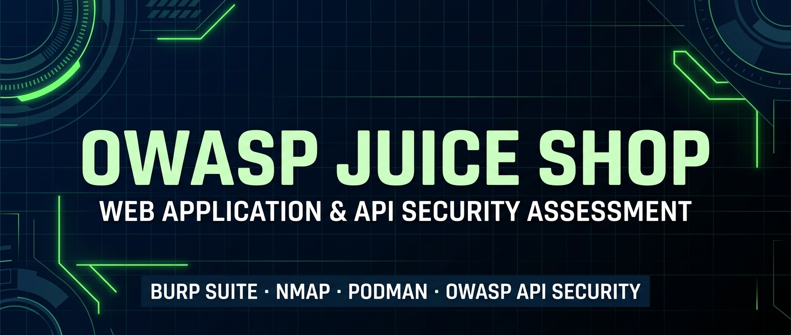

  

<h1 align="center">OWASP Juice Shop – Web Application & API Security Assessment</h1>

  <strong>Burp Suite</strong> •
  <strong>Nmap</strong> •
  <strong>Podman</strong> •
  <strong>OWASP API Security</strong>

## Executive Summary

This project demonstrates a structured Web Application and API Security Assessment of OWASP Juice Shop within an authorized local laboratory environment.

The assessment followed a practical security testing workflow covering reconnaissance, service and endpoint enumeration, vulnerability identification, manual validation, evidence collection, CVSS-based risk assessment, and remediation planning.

The assessment focused on authentication, authorization, API security, injection vulnerabilities, security misconfigurations, and information exposure.

# OWASP Juice Shop — Web Application & API Security Assessment

## Overview

This project documents a practical Web Application and API Security Assessment conducted against **OWASP Juice Shop** within an authorized local laboratory environment.

The assessment focuses on identifying, validating, and documenting common web application and API security weaknesses using a structured penetration-testing methodology.

## Objectives

* Perform target reconnaissance and service discovery
* Analyze HTTP communication using Burp Suite
* Enumerate web application and API endpoints
* Assess authentication mechanisms
* Test object-level authorization
* Test function-level authorization
* Assess injection-related risks
* Identify security misconfigurations
* Validate security findings using reproducible evidence
* Perform risk assessment and CVSS-based severity classification
* Provide appropriate remediation recommendations

## Assessment Methodology

**Reconnaissance**
↓
**Service & Endpoint Enumeration**
↓
**Application/API Analysis**
↓
**Vulnerability Identification**
↓
**Manual Validation**
↓
**Evidence Collection**
↓
**CVSS Risk Assessment**
↓
**Remediation Recommendations**

## Vulnerability Areas

The assessment covers:

* BOLA / IDOR
* Broken Authentication
* Broken Function-Level Authorization (BFLA)
* Injection
* Security Misconfiguration
* Excessive Data Exposure

## Tools

| Tool                         | Purpose                                    |
| ---------------------------- | ------------------------------------------ |
| Podman                       | Container deployment and management        |
| OWASP Juice Shop             | Intentionally vulnerable target            |
| Burp Suite Community Edition | Web application security testing           |
| Burp Proxy                   | HTTP traffic interception                  |
| Burp HTTP History            | Request and response analysis              |
| Burp Target / Site Map       | Application and API enumeration            |
| Burp Repeater                | Manual request modification and validation |
| Nmap                         | Port and service discovery                 |
| Web Browser                  | Application interaction                    |

## Key Findings

The assessment investigated the following security weaknesses:

| Finding | Security Area | Assessment |
|---|---|---|
| BOLA / IDOR | API Authorization | Tested |
| Broken Authentication | Authentication | Tested |
| BFLA | Authorization | Tested |
| Injection | Input Validation | Tested |
| Security Misconfiguration | Application Security | Tested |
| Excessive Data Exposure | Information Exposure | Tested |

Each finding was supported by evidence and evaluated according to its potential security impact.

## Selected Assessment Evidence

### Reconnaissance

### Burp Suite Traffic Analysis

### Vulnerability Validation

## Environment

**Target:** OWASP Juice Shop
**Target URL:** `http://localhost:3000`
**Protocol:** HTTP
**Port:** 3000
**Deployment:** Podman
**Environment:** Local authorized laboratory environment

## Report

The complete assessment report is available in the [`Report`](./Report/) directory.

## Skills Demonstrated

- Web Application Security Testing
- API Security Testing
- Reconnaissance & Enumeration
- HTTP Request/Response Analysis
- Authentication Testing
- Authorization Testing
- BOLA / IDOR Testing
- BFLA Testing
- Injection Testing
- Vulnerability Validation
- CVSS Risk Assessment
- Security Documentation
- Remediation Planning

## Disclaimer

This project was conducted strictly within an authorized local laboratory environment for educational and security-testing purposes.

No unauthorized systems or third-party applications were targeted.

## Repository

This repository contains the assessment methodology, evidence, report, and supporting documentation.

[View the complete project on GitHub](https://github.com/SethuBandara/owasp-juice-shop-security-assessment)
