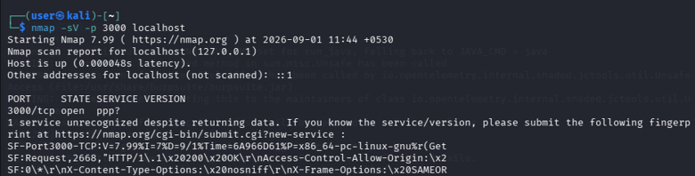
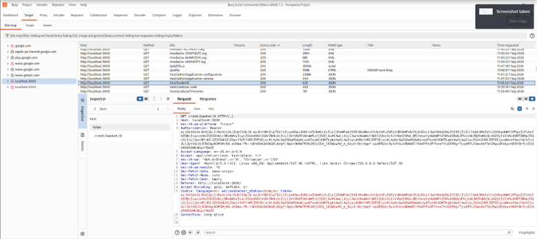
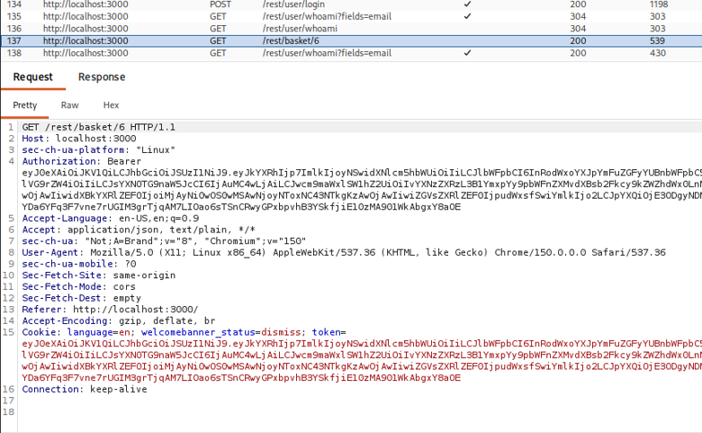

<p align="center">
  
</p>

<h1 align="center">OWASP Juice Shop – Web Application & API Security Assessment</h1>

<p align="center">
  <strong>Burp Suite</strong> •
  <strong>Nmap</strong> •
  <strong>Podman</strong> •
  <strong>OWASP API Security</strong>
</p>

---

## Executive Summary

This project demonstrates a structured Web Application and API Security Assessment of OWASP Juice Shop within an authorized local laboratory environment.

The assessment followed a practical security testing workflow covering reconnaissance, service and endpoint enumeration, vulnerability identification, manual validation, evidence collection, CVSS-based risk assessment, and remediation planning.

The assessment focused on authentication, authorization, API security, injection vulnerabilities, security misconfigurations, and information exposure.

---

## Project Overview

**OWASP Juice Shop** is an intentionally vulnerable web application used for security education and practical application-security testing.

This project was conducted to develop hands-on experience in identifying, validating, documenting, and assessing common web application and API security weaknesses.

The assessment involved analyzing HTTP requests and responses, identifying application and API endpoints, testing authorization controls, validating security findings, collecting reproducible evidence, and preparing remediation recommendations.

---

## Objectives

* Perform target reconnaissance and service discovery
* Analyze HTTP communication using Burp Suite
* Enumerate web application and API endpoints
* Assess authentication mechanisms
* Test object-level authorization
* Test function-level authorization
* Assess injection-related risks
* Identify security misconfigurations
* Validate security findings using reproducible evidence
* Perform risk assessment and CVSS-based severity classification
* Provide appropriate remediation recommendations

---

## Assessment Methodology

The assessment followed a structured security testing workflow:

**Reconnaissance**
↓
**Service & Endpoint Enumeration**
↓
**Application/API Analysis**
↓
**Vulnerability Identification**
↓
**Manual Validation**
↓
**Evidence Collection**
↓
**CVSS Risk Assessment**
↓
**Remediation Recommendations**

---

## Vulnerability Areas

The assessment investigated the following security areas:

* BOLA / IDOR
* Broken Authentication
* Broken Function-Level Authorization (BFLA)
* Injection
* Security Misconfiguration
* Excessive Data Exposure

---

## Tools & Technologies

| Tool / Technology                | Purpose                                                 |
| -------------------------------- | ------------------------------------------------------- |
| **OWASP Juice Shop**             | Intentionally vulnerable web application and API target |
| **Podman**                       | Container deployment and laboratory environment         |
| **Burp Suite Community Edition** | Web application security testing                        |
| **Burp Proxy**                   | HTTP traffic interception                               |
| **Burp HTTP History**            | Request and response analysis                           |
| **Burp Target / Site Map**       | Application and API enumeration                         |
| **Burp Repeater**                | Manual request modification and validation              |
| **Nmap**                         | Port and service discovery                              |
| **Web Browser**                  | Application interaction and testing                     |

---

## Key Findings

The assessment investigated the following security weaknesses:

| Finding                   | Security Area        | Assessment Status |
| ------------------------- | -------------------- | ----------------- |
| BOLA / IDOR               | API Authorization    | Tested            |
| Broken Authentication     | Authentication       | Tested            |
| BFLA                      | Authorization        | Tested            |
| Injection                 | Input Validation     | Tested            |
| Security Misconfiguration | Application Security | Tested            |
| Excessive Data Exposure   | Information Exposure | Tested            |

Each investigated finding was supported by assessment evidence and considered for security impact and remediation.

> **Note:** Detailed technical evidence, risk ratings, and remediation recommendations are documented in the assessment report.

---

## Selected Assessment Evidence

### Reconnaissance



### Burp Suite Traffic Analysis



### BOLA / IDOR Validation



Additional evidence is available in the [`Evidence`](./Evidence/) directory.

---

## Environment

| Configuration   | Details                     |
| --------------- | --------------------------- |
| **Target**      | OWASP Juice Shop            |
| **Target URL**  | `http://localhost:3000`     |
| **Protocol**    | HTTP                        |
| **Port**        | 3000                        |
| **Deployment**  | Podman                      |
| **Environment** | Authorized local laboratory |

---

## Project Structure

```text
owasp-juice-shop-security-assessment/
│
├── Evidence/
│   ├── Reconnaissance/
│   ├── BOLA-IDOR/
│   ├── Authentication/
│   ├── BFLA/
│   ├── Injection/
│   └── Security-Misconfiguration/
│
├── Report/
│   └── Web_Application_API_Security_Assessment.pdf
│
├── project-banner.png
└── README.md
```

---

## Assessment Report

The complete technical assessment report contains the detailed methodology, vulnerability analysis, evidence, risk assessment, CVSS evaluation, and remediation recommendations.

📄 **[View the Assessment Report](./Report/)**

🔎 **[View Assessment Evidence](./Evidence/)**

---

## Skills Demonstrated

* Web Application Security Testing
* API Security Testing
* Reconnaissance & Enumeration
* HTTP Request/Response Analysis
* Authentication Testing
* Authorization Testing
* BOLA / IDOR Testing
* BFLA Testing
* Injection Testing
* Vulnerability Validation
* CVSS Risk Assessment
* Security Documentation
* Remediation Planning

---

## Disclaimer

This project was conducted strictly within an authorized local laboratory environment for educational and security-testing purposes.

No unauthorized systems or third-party applications were targeted.

---

## Repository

This repository contains the assessment methodology, technical evidence, security findings, assessment report, and supporting documentation.

**GitHub Repository:**
https://github.com/SethuBandara/owasp-juice-shop-security-assessment
